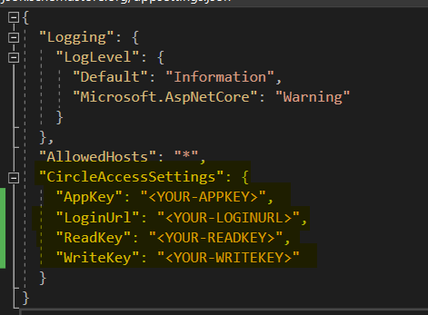
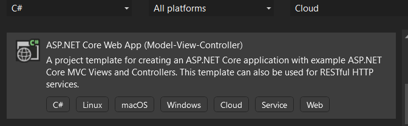
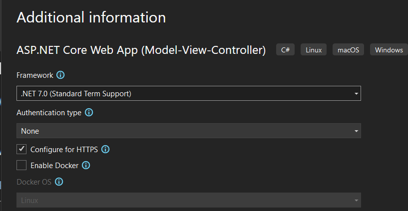
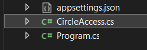
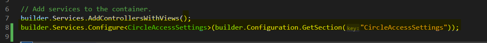
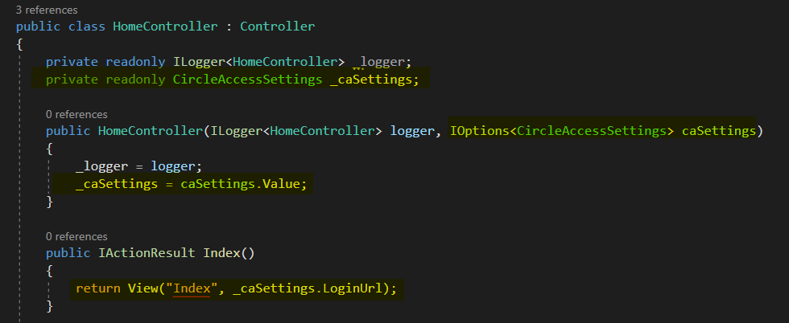
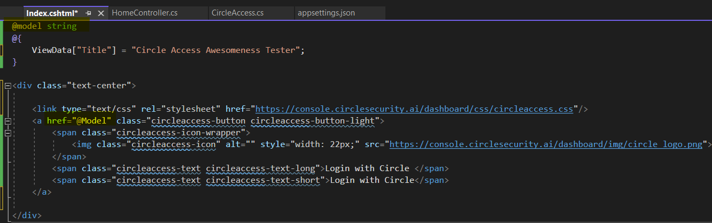
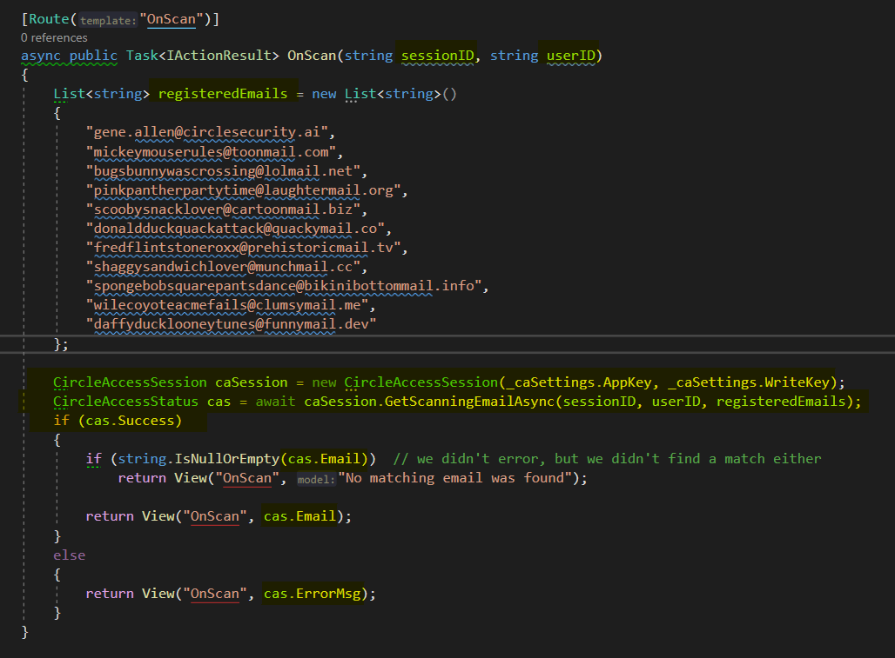

# Demo for Circle Access using Asp.net Core
In this tutorial, we’ll create an application that displays a web page with a single ‘Login with Circle’ button, when the user clicks it, they will be redirected to the authentication page which will show a QR Code.

Upon scanning the QR Code, the user’s browser will be redirected to the registered callback, which we will implement in the Home Controller.  

In the controller method, we will pass a list of registered email addresses to the supplied helper class, CircleAccessSession, which will return the email address that is registered on the scanning device, if it’s found.

**Decision time:**
*	Do you want to get up and running super quick, see it in action, then figure out what’s going on?  
*	Or do you want to start from scratch and do the steps yourself?

## I want to use the super quick method!
1.	Pull the repro
1.	Change the appsettings.json to match your application
    1.	Make sure that the Logon Return URL is https://localhost:7192/OnScan
    	
1.	Run the project 

## I’m need to know what’s going on..show me step-by-step guide:
1.	Application Setup:
	1.	Create an ASP.NET Core Web App (MVC) in Visual Studio.
 	
	1.	Select the .NET 7 framework and ‘None’ as the Authentication type.
  	
1.	Project Configuration:
	1.	Open the appsettings.json file and add the CircleAccessSettings section.
    	 
	1.	Replace AppKey, LoginUrl, and WriteKey with your values.
	1.	Pull the CircleAccess.cs file from the repo and add it to your project.
       	
	1.	In the Program.cs file, add the highlighted line.
 			
1.	HomeController Configuration:
	1.	In the HomeController, use Dependency Injection to get the Circle Access Setting.
	1.	Add a member variable _caSetting to hold it, set in the constructor.
	1.	In the Index method, pass the LoginUrl as the model to Index.cshtml.
    	
1.	Index.cshtml Configuration:
	1.	Declare the model as a string.
	1.	Use it in the href for the ‘Login with Circle’ button.
	1.	Add HTML for a visually appealing button.
    	
1.	OnScan Method:
	1.	Configure the Circle Application Manager with a defined Login Return URL pointing to a method called onscan.
	1.	Create the OnScan method to process the scan and determine the login attempt.
	1.	Query the sessionID to get information about the user who scanned the QR Code.
	1.	Hardcode registeredEmails (typically pulled from your user database).
	1.	Set up the CircleAccessSession helper class, passing in your AppKey and WriteKey.
	1.	Call GetScanningEmailAsync to get a CircleAccessStatus object.
	1.	Handle processing errors, and display the result in the OnScan.cshtml view.
    	
